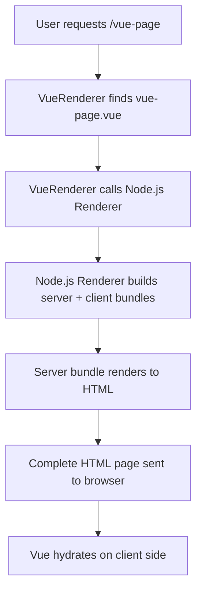

# Frappe Vue SSR

Server-side rendering (SSR) for Vue.js Single File Components (SFCs) in Frappe apps.

> [!WARNING]
>
> This is a proof-of-concept of Vue SSR Rendering in Frappe apps. For production use, several improvements are needed:
>
> - **Pre-rendering** - Components are currently built on-demand during requests
> - **Shared bundling** - Each page creates separate bundles, causing duplication across multiple pages
> - **CSS optimization** - Styles are currently inlined instead of being extracted to separate files

## How SSR Rendering Works

This app implements a Vue SSR renderer that renders `www/<page>.vue`, allowing you to create server-rendered Vue pages that hydrate on the client side.

### Architecture Overview

The SSR system has one main component:

**VueRenderer (Python)** - `vue_renderer.py` - The core SSR handler that internally calls a Node.js subprocess (`vue_ssr_renderer.js`) for Vue compilation and rendering

### SSR Workflow

<details>
<summary>Click to view workflow diagram</summary>



</details>

### VueRenderer Implementation

#### VueRenderer (Python) - `vue_renderer.py`

**File Discovery**

- Searches through all installed Frappe apps
- Looks for `.vue` files in `/www` folders matching the URL path
- Example: `/vue-page` → searches for `vue-page.vue`

**Node.js Integration**

- Validates Node.js v22+ availability (required for Vue SSR)
- Calls Node.js subprocess with `vue_ssr_renderer.js`
- Passes component path and server data as arguments

**HTML Generation**

- Builds complete HTML page with SSR content
- Includes Vue hydration scripts and styles
- Handles client bundle serving via Frappe assets

#### Internal Node.js Subprocess - `vue_ssr_renderer.js`

**Component Validation**

- Validates Vue SFC structure (`<template>`, `<script>`, `<style>`)
- Checks for common HTML issues (unclosed tags, etc.)

**Vite Project Creation**

- Creates temporary Vite project structure
- Generates entry files for server and client builds:
  - `server.js` - Uses `@vue/server-renderer`
  - `client.js` - Handles client-side hydration
  - `app.js` - Creates Vue app instance
  - `component.js` - Imports the original Vue file

**Dual Bundle Build**

```javascript
// Server bundle (SSR)
build({
  ssr: true,
  rollupOptions: {
    input: entries.server,
    external: ["vue", "@vue/server-renderer"],
  },
});

// Client bundle (hydration)
build({
  rollupOptions: {
    input: entries.client,
    format: "iife",
  },
});
```

**Cache Management**

- Caches built bundles based on file path + modification time
- Avoids rebuilding unchanged components

**SSR Rendering**

- Uses Vue's `renderToString()` for server-side rendering
- Extracts styles from `<style>` blocks
- Copies client bundle to public directory

Registers the VueRenderer with Frappe's routing system to handle `.vue` file requests.

### Example: vue-page.vue

See [`frappe_vue_ssr/www/vue-page.vue`](frappe_vue_ssr/www/vue-page.vue) for a complete example that demonstrates a modern Vue 3 SFC.

**Features Supported:**

- ✅ Vue 3 Composition API (`<script setup>`)
- ✅ Frappe UI components with Tailwind CSS integration
- ✅ Lucide icon integration (`~icons/lucide/plus`)
- ✅ CSS imports and styling
- ✅ Reactive state management
- ✅ Event handling
- ✅ Server-side rendering + client hydration

### Usage

1. Create a `.vue` file in your app's `/www` folder
2. Access it via the corresponding URL path
3. The VueRenderer automatically handles SSR + hydration

**Example:**

- File: `my_app/www/dashboard.vue`
- URL: `https://yoursite.com/dashboard`
- Result: Server-rendered Vue page with client-side hydration
